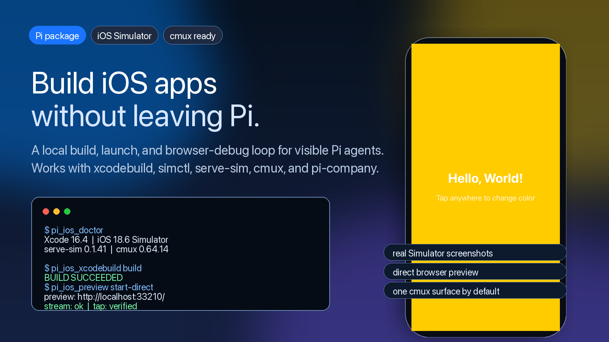

# pi-build-ios-apps

[中文](docs/README.zh-CN.md)



> Build, launch, and browser-debug iOS Simulator apps from Pi.

`pi-build-ios-apps` gives the Pi coding agent a real local iOS build loop:
inspect Xcode, run `xcodebuild`, install and launch apps with `simctl`, mirror
the Simulator through `serve-sim`, and reuse a cmux browser surface for visual
debugging.

It is designed for visible, local, human-steerable mobile app development.


## Why This Exists

Coding agents can usually edit an iOS app, but they often stop right before the
part that proves the app actually works: build it, launch it, look at the
Simulator, tap the UI, and report what happened.

`pi-build-ios-apps` closes that gap for Pi.

It gives Pi tools for the parts of iOS work that need local runtime evidence:

- Xcode and iOS Simulator environment checks
- `xcodebuild` scheme listing, build, test, clean, and build-for-testing
- `xcrun simctl` boot, install, launch, terminate, and screenshot
- `serve-sim` start, status, stop, tap, type, button, and rotate
- direct browser preview fallback when the official `serve-sim` page is stuck
  on `Connecting`
- cmux browser preview reuse, so agents do not keep opening new browser tabs

## Install

From npm:

```sh
pi install npm:pi-build-ios-apps
```

From GitHub:

```sh
pi install git:github.com/aa2246740/pi-build-ios-apps
```

Project-local install:

```sh
pi install -l git:github.com/aa2246740/pi-build-ios-apps
```

From a local checkout:

```sh
pi install /path/to/pi-build-ios-apps
```

Try it once without installing:

```sh
pi -e /path/to/pi-build-ios-apps/extensions/pi-build-ios-apps.ts \
  --skill /path/to/pi-build-ios-apps/skills/pi-build-ios-apps
```

## Quick Start

Inside an iOS project:

```sh
pi
```

Then ask Pi:

```text
Use pi-build-ios-apps. Run the iOS doctor first, then build and launch this app
on the booted iOS Simulator. Do not modify system proxy settings. If you use a
browser preview, reuse the existing cmux browser surface unless a new one is
necessary.
```

## Tools

This package registers six Pi tools:

| Tool | Purpose |
| --- | --- |
| `pi_ios_doctor` | Inspect Xcode, runtimes, Node/npm, CocoaPods, serve-sim, and cmux. |
| `pi_ios_xcodebuild` | Run scoped `xcodebuild` actions for projects and workspaces. |
| `pi_ios_simulator` | Manage Simulator boot, install, launch, terminate, and screenshot. |
| `pi_ios_serve_sim` | Start, stop, inspect, and interact with `serve-sim` for one UDID. |
| `pi_ios_preview` | Start a direct MJPEG preview page for stuck `Connecting` cases. |
| `pi_ios_cmux_open` | Open or reuse a cmux browser surface for an iOS preview URL. |

## The Loop

```text
Pi reads the project
  -> pi_ios_doctor checks the local Apple toolchain
  -> pi_ios_xcodebuild builds or tests the app
  -> pi_ios_simulator installs and launches it
  -> pi_ios_serve_sim mirrors the booted Simulator
  -> pi_ios_cmux_open reuses one browser surface for visual QA
  -> Pi reports the exact proof boundary
```

## Works Well With pi-company

`pi-build-ios-apps` is a strong companion to
[`pi-company`](https://github.com/aa2246740/pi-company).

`pi-company` turns multiple visible Pi sessions into a local project team:
lead, coder, reviewer, tester, PM, issue ownership, worktrees, and gates.
This package gives that team the missing mobile runtime loop.

```text
human -> pi-company lead -> coder worktree -> iOS build/run
      -> tester Simulator validation -> review gates -> acceptance -> merge
```

With cmux installed, the whole thing can stay visible: Pi panes on one side,
the Simulator browser preview on the other, and no hidden cloud service in the
middle.

## React Native, Expo, and HealthKit

This package is not SwiftUI-only. It is useful for any iOS app that can be
built or launched through the local Xcode toolchain.

For React Native and Expo native projects:

- keep Metro running before launching a dev build
- pass launch environment such as `RCT_METRO_PORT` through `pi_ios_simulator`
- expect CocoaPods when the native iOS project or module ecosystem requires it
- do not assume SwiftPM replaces Pods for React Native native modules

## Safety Boundaries

`pi-build-ios-apps` is intentionally local and explicit:

- It does not modify system proxy settings.
- It does not require CocoaPods unless the target project itself requires Pods.
- It scopes `serve-sim` cleanup to one explicit Simulator UDID.
- It defaults cmux preview work toward one reusable browser surface.
- It asks Pi to report commands, URLs, simulator IDs, and proof boundaries.

Pi packages can execute local code. Review the source before installing any
third-party package.

## Demo Media and Privacy

The screenshots and GIF in this repository were generated from a synthetic
`ColorTap` demo app running on a local iOS Simulator. They do not contain real
health data, private source code, API keys, proxy configuration, private Git
remotes, or personal machine paths.

## Requirements

- macOS
- Xcode with an iOS Simulator runtime
- Node.js 20+
- Pi coding agent
- `serve-sim` available through `npx --yes serve-sim@latest`
- Optional but recommended: cmux

## Development

```sh
npm install
npm run typecheck
npm pack --dry-run
```

Local smoke test:

```sh
pi -e ./extensions/pi-build-ios-apps.ts \
  --skill ./skills/pi-build-ios-apps
```

## Not Affiliated

This is an independent community package. It is not affiliated with Apple,
OpenAI, Codex, Pi, cmux, or the `serve-sim` project unless explicitly stated.

## License

Apache-2.0
